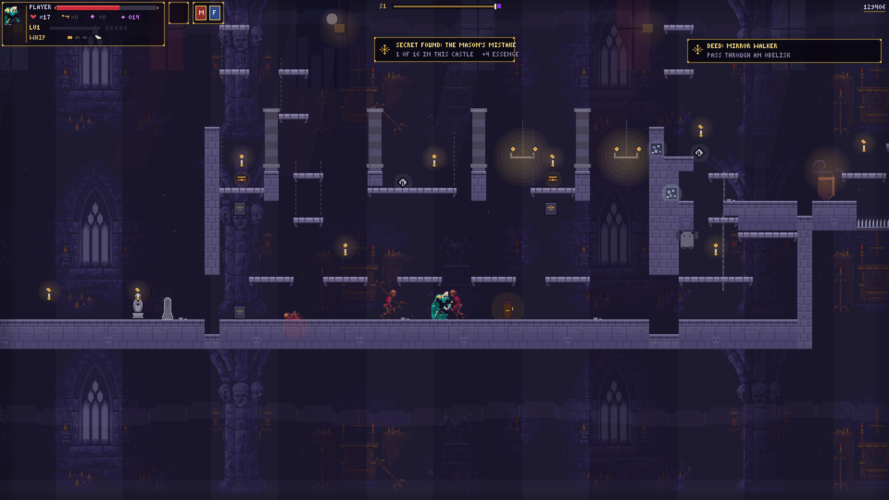
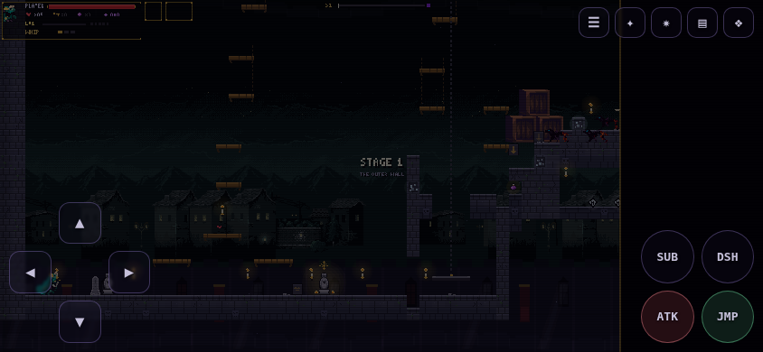

# 🌙 Moonfang Castle



> A gothic action‑platformer roguelite. Explore **one great, procedurally‑built castle**, master a deep arsenal, and bring down its guardians to earn the traversal powers that open the way deeper in. Written from scratch in **vanilla JavaScript** on a single `<canvas>` — no engine, no framework, no runtime dependencies.

Think *Castlevania: Circle of the Moon* by way of a roguelite: a Metroidvania‑gated castle that regenerates every run, an arcana card system, weapon tempering and crafting, relics, mining, and a nine‑stage campaign that ends at **The Moonfang**.

---

## ✨ Features

**The castle**
- **19 themed zones** raised end‑to‑end into one continuous castle — outer wall, cemetery, cathedral, belfry, catacombs, cistern, clock ruin, foundry, keep, gallery, spire, observatory, abyss, and the lunar heart — each with its own biome, backdrop, staging, hazards, and hand‑authored **room grammars**.
- **Procedural generation** with authored structure: rooms are built in four beats (*kishōtenketsu*), towers/shafts/lifts stitch the elevations together, and a battery of `finishWorld` passes guarantee the whole thing is **walkable** (spine carve, trap‑escape, connector re‑opening, no one‑way pits).
- A **2D fog‑of‑war map** with named regions, player‑placed marks, and Castlevania‑style **scene cuts** as you cross room edges.
- **Sealed chambers, sky islands, warp obelisks, forges, shrines, and a wandering merchant** hidden throughout.

**The hunt**
- **30 main weapons** and **19 sub‑weapons** — whip, sword, axe, spear, claws, scythe, censer, glaive, and more — every one forgeable, each with its own reach, swing arc, and on‑hit effects.
- **53 skills** across three trees, **24 perks** (×4 ranks), timed **buffs**, and generated **relics** with rarity tiers and set bonuses.
- **A 4 × 13 arcana card system** (~50 pairings), **194 crafting recipes**, **mining** across 11 materials, and per‑weapon **mastery**.
- **Boss guardians** that each grant a traversal power — *wings, gallop, maw, tide, ember, mist* — which unlock the warded gates gating the castle (the Metroidvania loop).
- A finishable **9‑stage campaign** to the three‑phase final boss, plus **boss rush**, a **daily seed**, and endless play.
- **100+ bestiary forms** (11 elemental variants × species), **36 persistent deeds**, lore tablets, and meta‑unlocks — all saved to `localStorage`.

**Play anywhere**
- Runs in any modern browser, wraps as a **desktop app** via Electron, and ships with **on‑screen touch controls** for phones and tablets.
- Full **keyboard** and **gamepad** support.

---

## 🎮 Controls

| Action | Keyboard | Gamepad |
| --- | --- | --- |
| Move | Arrow keys / `WASD` | D‑pad / left stick |
| Jump | `X` · `K` · `Space` | A |
| Attack | `Z` · `J` | X |
| Dash / back‑dash | `C` · `L` | B |
| Throw sub‑weapon | **Up + Attack** | Up + X |
| Item Crash (super) | `E` | RB |
| Arcana / cards | `Q` | LB |
| Satchel | `I` | select |
| Map | `Tab` · `V` | L3 |
| Swap weapon | `1`–`9` | — |
| Place a map mark | `G` | — |
| Pause / confirm | `Enter` | Start |

On the title screen: `R` continue last run · `Y` daily seed · `B` boss rush · `N` bestiary · `F` feats.
`M` toggles music, `[` / `]` adjust volume, `F3` shows the debug overlay.

---

## 📱 Play on mobile



Open the site on a phone in **landscape** and an on‑screen overlay appears automatically: a d‑pad on the left, `JMP` / `ATK` / `DSH` / `SUB` on the right, and a translucent utility row (start/pause, arcana, item crash, satchel, map). The controls only show on touch devices — append `?touch=1` to any URL to preview them on a desktop, or `?touch=0` to force them off.

---

## 🚀 Running it

The game is **plain static files** — `index.html` loads the scripts in `js/` and the art in `assets/`. There is no build step to play it.

```bash
# Play in a browser — serve the folder and open it
npx serve .            # or:  python3 -m http.server 8000
# → http://localhost:8000
```

```bash
# Desktop app (Electron)
npm install
npm start              # sandboxed Linux? use:  npm start -- --no-sandbox
```

```bash
# Build the desktop app  →  dist/*.AppImage + dist/*.tar.gz
npm run dist

# Build the trimmed static bundle for web hosting  →  web-dist/
npm run build:web

# Build + deploy web-dist/ to Cloudflare Pages (needs `wrangler login` first)
npm run deploy
```

**Host it online for free.** Because it's static, `web-dist/` (or the repo root) drops straight onto **Cloudflare Pages**, **GitHub Pages**, or **Netlify** — no server required. Each player's progress lives in their own browser's `localStorage`.

---

## 🗂️ Project layout

```
.
├─ index.html          # entry point — sizes the canvas, loads the modules in order
├─ main.js             # Electron desktop shell (not used on the web)
├─ js/                 # the game, as ordered classic scripts
│  ├─ config.js        # data registries: weapons, skills, zones, recipes, arcana…
│  ├─ level.js         # world generation — buildWorld / room grammars / finishWorld
│  ├─ game.js          # main loop, input, state machine, combat, camera
│  ├─ player.js  enemies.js  bosses.js  projectiles.js  pickups.js
│  ├─ sprites.js  audio.js  font.js  systems.js  ui.js
│  └─ touch.js         # mobile on-screen controls (browser only)
├─ assets/             # CC0 Gothicvania art  (see assets/CREDITS.txt)
├─ tools/              # headless QA harnesses (see below)
└─ docs/               # README images
```

---

## 🧪 Development & QA

There is no browser required to validate changes — the project ships with headless harnesses that run on a software canvas:

```bash
node tools/smoke.js        # simulated playthroughs across every game state
node tools/audit.js        # structural QA — proves the castle is built & walkable
node tools/design.js       # design audit — pacing, difficulty curve, risk vs reward
node tools/render.js out/  # render real PNG frames of every zone, boss, and menu
```

`tools/render.js` is how the screenshots in this README were produced.

---

## 🎨 Credits

All art is **CC0 / public domain** from the wonderful **“Gothicvania”** series by **Ansimuz (Luis Zuno)** — [ansimuz.itch.io](https://ansimuz.itch.io) / [opengameart.org](https://opengameart.org) — with additional CC0 props by *ettingrinder* and *Stealthix*. No attribution is required for these assets; it is given here gladly. See [`assets/CREDITS.txt`](assets/CREDITS.txt) for the full per‑file breakdown.

## 📄 License

The **art assets** in `assets/` are CC0 / public domain (see credits above). A license for the **game code** has not been specified yet — add a `LICENSE` file if you intend others to reuse it.
